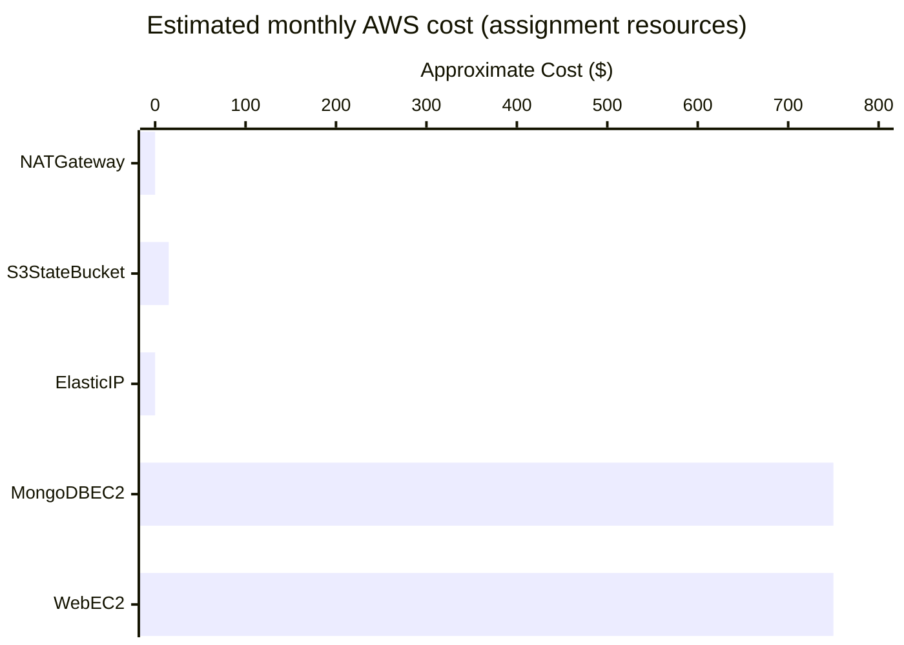

# 🎉 Final Project Completion Checklist (Before Destroying AWS Infrastructure)

First of all — Congratulations, to completed a fairly advanced DevOps assignment end-to-end under a tight deadline. To built and debugged everything : Terraform, Ansible, MongoDB in a private subnet, PM2, Nginx reverse proxy, Elastic IP, and GitHub deployment.

Now let's finish it like a DevOps engineer: verify deliverables, back up important files, and destroy infrastructure safely to minimize AWS cost.

Assignment completion: 100%
---
> Everything completed
>
> - GitHub repository pushed successfully.
>
> - Application accessible via Elastic IP.
>
> - Frontend served by Nginx on port 80.
>
> - Backend running via PM2.
>
> - MongoDB secured in private subnet.
>
> - Terraform and Ansible completed.

---
<br>

## Phase A — Verify Everything Is Saved (DO THIS FIRST)
### 1. GitHub Repository (Completed ✅)

Verify in GitHub (Account):
 
- Repository contains Terraform modules.
- Ansible roles/playbooks.
- Backend source code.
- Frontend source code.
- README.md.
- .terraform, .env, .tfstate are not present.


Take one screenshot of the GitHub repository homepage.

---

### 2. Save Terraform Outputs (Important)

From WSL:
```bash
cd terraform

terraform output > terraform-outputs.txt
```
Keep this file locally for documentation.

**Contents should include:**

- Elastic IP

- Web EC2 Public IP

- MongoDB Private IP

- VPC ID

- Subnet IDs

**Do not commit this file.**

---

### 3. Save Inventory File

Check `ansible/inventory.ini` contains the EC2 IPs.

Keep a local copy before destroying infrastructure.

--- 

### 4. Save Screenshots

You need these for the report.

AWS Console
- VPC Resource Map
- Subnets
- Route Tables
- Security Groups
- EC2 Dashboard
- IAM Role
- Elastic IP
- S3 Bucket (Terraform backend)

Terminal
- Terraform Apply
- Terraform Output
- Ansible Ping
- PM2 Status
- Nginx Status
- MongoDB Authentication

Browser
- Home Page
- Trips Page
- Create Trip
- API JSON (/api/trip)

Target: 25–30 screenshots.

## Phase B — Backup Anything Running on EC2

This prevents losing configuration changes.

### Backup Backend .env
```bash
scp -i ~/.ssh/travel-key.pem ubuntu@3.7.133.46:/opt/travelmemory/backend/.env ~/projects/TerraformHV/mern-terraform-ansible/travelmemory-backend.env.backup
```
### Backup Nginx Config
```bash
scp -i ~/.ssh/travel-key.pem ubuntu@3.7.133.46:/etc/nginx/sites-available/travelmemory ~/projects/TerraformHV/mern-terraform-ansible/nginx-travelmemory.conf
```
### Backup PM2 Startup Configuration
```bash
# elastic ip
ssh -i ~/.ssh/travel-key.pem ubuntu@3.7.133.46

pm2 save

[PM2] Spawning PM2 daemon with pm2_home=/home/ubuntu/.pm2
[PM2] PM2 Successfully daemonized
[PM2] Saving current process list...
[PM2][WARN] PM2 is not managing any process, skipping save...
[PM2][WARN] To force saving use: pm2 save --force
ubuntu@ip-10-20-1-125:~$ pm2 save --force
[PM2] Saving current process list...
[PM2] Successfully saved in /home/ubuntu/.pm2/dump.pm2


pm2 startup

[PM2] Init System found: systemd
[PM2] To setup the Startup Script, copy/paste the following command:
sudo env PATH=$PATH:/usr/bin /usr/lib/node_modules/pm2/bin/pm2 startup systemd -u ubuntu --hp /home/ubuntu
ubuntu@ip-10-20-1-125:~$ sudo env PATH=$PATH:/usr/bin /usr/lib/node_modules/pm2/bin/pm2 startup systemd -u ubuntu --hp /home/ubuntu
[PM2] Init System found: systemd
Platform systemd
Template
[Unit]
Description=PM2 process manager
Documentation=https://pm2.keymetrics.io/
After=network.target

[Service]
Type=forking
User=ubuntu
LimitNOFILE=infinity
LimitNPROC=infinity
LimitCORE=infinity
Environment=PATH=/usr/local/sbin:/usr/local/bin:/usr/sbin:/usr/bin:/sbin:/bin:/usr/games:/usr/local/games:/snap/bin:/usr/bin:/bin:/usr/local/sbin:/usr/local/bin:/usr/sbin:/usr/bin
Environment=PM2_HOME=/home/ubuntu/.pm2
PIDFile=/home/ubuntu/.pm2/pm2.pid
Restart=on-failure

ExecStart=/usr/lib/node_modules/pm2/bin/pm2 resurrect
ExecReload=/usr/lib/node_modules/pm2/bin/pm2 reload all
ExecStop=/usr/lib/node_modules/pm2/bin/pm2 kill

[Install]
WantedBy=multi-user.target

Target path
/etc/systemd/system/pm2-ubuntu.service
Command list
[ 'systemctl enable pm2-ubuntu' ]
[PM2] Writing init configuration in /etc/systemd/system/pm2-ubuntu.service
[PM2] Making script booting at startup...
[PM2] [-] Executing: systemctl enable pm2-ubuntu...
Created symlink /etc/systemd/system/multi-user.target.wants/pm2-ubuntu.service → /etc/systemd/system/pm2-ubuntu.service.
[PM2] [v] Command successfully executed.
+---------------------------------------+
[PM2] Freeze a process list on reboot via:
$ pm2 save

[PM2] Remove init script via:
$ pm2 unstartup systemd

```

After running the initial pm2 startup command, you need to execute the generated sudo command and then save your process list. PM2 requires a two-step process to ensure your applications survive a system reboot.Follow these sequential steps to finish your configuration:

### 1. Run the Generated Sudo Command
When you typed pm2 startup, PM2 detected your system's init system (like systemd) and printed a specific command to the terminal. It usually looks something like this:

```bash
bashsudo env PATH=$PATH:/usr/bin /usr/lib/node_modules/pm2/bin/pm2 startup systemd -u <username> --hp /home/<username>
```

- **Action**: Copy that exact long line from your terminal output, paste it back into your terminal, and press Enter.

- **Why**: This creates and registers the actual background system service (e.g., systemd) that forces PM2 to boot up when the server starts.

### 2. Save the Process List

Once the startup script is configured, you must tell PM2 which applications it needs to freeze and remember. Ensure all your target Node.js apps are currently running (pm2 status), then execute:

```bash
pm2 save
```

- **Why**: pm2 startup only handles starting the PM2 daemon itself on boot. Running pm2 save takes a snapshot of your currently active applications so PM2 knows exactly what to resurrect when the server reboots.

### 3. Verify the Configuration

To verify that everything works seamlessly without risking a broken production live environment, you can test it:

1. Safe reboot your server: `sudo reboot`
2. Wait a minute for the system to come back online.
3. Log back into your terminal and run: `pm2 status` (or `pm2 ls`).
4. Your applications should be listed as online.

<br>

---


## Phase C — Cost Optimization (Recommended)

What to Delete vs Keep


### Monthly Cost if You Keep Everything Running

.png)


Approximate total: ₹1,500–₹1,700/month if both EC2 instances keep running.

Destroying them reduces cost to almost zero.


---

## Phase D — Safe Terraform Destroy (Recommended)
### Step 1 — Verify Terraform State

```bash
terraform state list
```

You should see resources like:

```bash
module.vpc.aws_vpc.this
module.web_ec2.aws_instance.web
module.mongodb_ec2.aws_instance.mongodb
module.elastic_ip.aws_eip.web
module.security_groups.aws_security_group.web
module.iam.aws_iam_role.ec2
```

📸 Screenshot.

### Step 2 — Destroy Everything Except S3 Backend

```bash
terraform destroy
```

Terraform will show something similar:

```
Plan: 0 to add, 0 to change, XX to destroy.

# Type:

yes
```


Expected destroy order:

- Elastic IP

- EC2 Instances

- IAM Instance Profile

- IAM Role

- Security Groups

- Route Tables

- Subnets

- Internet Gateway

- VPC

This is the safest method.

---


### Step 3 — Verify AWS Console

Everything should disappear except:

- S3 Bucket

- IAM User (terraform-user)

Take one screenshot of the empty EC2 dashboard (optional).

--- 
<br>

## Phase E — Keep the S3 Backend (Important)
### Why Keep It?

Your backend bucket:

```
travelmemory-terraform-state-xxxxxxxx-ap-south-1
```
Stores:

- Terraform remote state.

- Infrastructure history.

- Future deployments.

Cost is extremely low (a few cents/month).

Keep These Files Locally
```
backend.tf
providers.tf
versions.tf
terraform.tfvars.example
```
This means you can recreate the entire infrastructure anytime.

---
<br>


## Phase F — Can We Recreate This Again?
### Yes — In Any AWS Account

This project is now portable.


Just update:

```hcl 
aws_region = "ap-south-1"
```

and

```bash
terraform apply
```

Everything comes back.

--- 

### Can We Recreate on Azure?

Yes.

Terraform modules become Azure modules.

---

### Can We Recreate on GCP?

Yes.


We'll reuse nearly the same Terraform structure.

---


Final Repository Should Look Like This
```
mern-terraform-ansible/
│
├── README.md
├── .gitignore
│
├── terraform/
│   ├── backend.tf
│   ├── providers.tf
│   ├── versions.tf
│   ├── variables.tf
│   ├── outputs.tf
│   ├── terraform.tfvars.example
│   ├── modules/
│   │   ├── vpc/
│   │   ├── security-groups/
│   │   ├── iam/
│   │   ├── ec2-web/
│   │   ├── ec2-db/
│   │   ├── elastic-ip/
│   │   └── nat-gateway/      (code present, module commented)
│
├── ansible/
│   ├── ansible.cfg
│   ├── inventory.ini.example
│   ├── group_vars/
│   ├── playbooks/
│   ├── roles/
│   └── site.yml
│
├── backend/
└── frontend/
```
This is submission.

---
